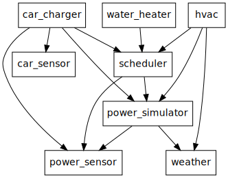

This project is about **Solar power usage optimization in a residential home**. It is a set of software components and services scheduling and optimizing devices in the a residential to make the best use of solar generated power.

Back in May 2021, I installed solar panel on my roof. As a software engineer concerned by the global warming I decided to develop an optimization system to reduce my carbon footprint. As I would like this project to benefit other and to keep growing I decided to share it publicly.

Optimizing means a good understanding of what to optimize. I spent some time online and I started collecting data from my electrical panel by installing sensors. I quickly to identified the following four targets (in order of priority):

1.  The electric car
2.  The HVAC (Heating, Ventilation, and Air Conditioning),
3.  The water heater
4.  The pool pump

**Note**: As of today, the system covers the first three as I still need to find the right switch to control the pool pump.

An optimization system also requires performance metrics.  My motivation being environmental and knowing that the utility companies of my city are mostly producing electricity out of fossil energies, I decided to measure the performance as the ratio of energy used from the solar panel over the total energy used. It means that the goal of the system is to fit as much as possible the home electricity needs in the time frame the solar panels are producing.

I have set up two targets:

1.  The electric car should be charged at 100% with solar produced energy
2.  The home energy consumption (including the car charger) must be covered at more than 65% by the solar energy

As of today, between `June 2021` and `February 2022`, the entire home energy consumption has been covered by solar energy at `63%`.

The following diagram represents the distribution of the energy consumption of my home per month since I started this project. It also include the per-month ratio of energy used which originated from the solar panels.

The implementation relies on various modules providing services such as weather forecast, instant power consumption records, solar power prediction, home thermal model, appliances controls and a scheduler. In a modest way, this is learning system. Indeed, it collects data and uses this data to generate models which influence the system decisions.

This project also includes some basic Home Assistant integration to ease the monitoring and control of the system as seen in the following screen capture.

The software architecture is based on well separated python modules running in dedicated processes. Each module implements defined interfaces such as [Sensor](doc/sensor.md#sensor-objects) or [Task](doc/scheduler.md#task-objects). Alternatively or in addition, a module can expose its a original Service interface. The inter-processes communication is provided by the [pyro5](https://pypi.org/project/Pyro5/) remote objects communication library. Each service, sensor or task is registered to the pyro5 nameserver under the `home-manager` namespace.  The services are under the `home-manager.service` sub-namespace, the sensors under the `home-manager.sensor` sub-namespace and the tasks are under the `home-manager.task` sub-namespace. For instance, the task responsible of the HVAC system is implemented by the [hvac](./src/hvac.py) module and registered as `home-manager.task.hvac` to the nameserver.

The following diagram represents the most important dependencies between the principal modules.

The main sensors are:

1.  The [power\_sensor](./doc/power_sensor.md) (`home_manager.sensor.power`) module provides instantaneous power consumption and power production readings. It also provides power reading over a certain period of time such as one minute, one hour or one day. This sensor is used by the [scheduler](./doc/scheduler.md) to build power consumption statistics leading to task scheduling decisions. Some task such as the [car\_charger](./doc/car_charger.md) also uses this sensor.
2.  The [power\_simulator](./doc/power_simulator.md) (`home_manager.sensor.power_simulator` and `home_manager.sensor.power_simulator`) module implements the solar panel model of my installation using the python [pvlib](https://pvlib-python.readthedocs.io/en/stable/) library.
    -   Similarly to [power\_sensor](./doc/power_sensor.md) the sensor part of this module provides instantaneous power consumption and production readings except that the production reading are based on a solar panel model and the consumption reading are based on current the tasks status. This [power\_simulator](./doc/power_simulator.md) is used as an alternative if [power\_sensor](./doc/power_sensor.md) is failing by the [scheduler](./doc/scheduler.md) and the [car\_charger](./doc/car_charger.md).
    -   The service part of this module provides properties and functions such as:
        -   the [max\_available\_power](./doc/power_simulator.md#max_available_power) property which is the maximum instantaneous power in kW the solar panels are expected to deliver from now to the end of daytime
        -   the [next\_power\_window(power)](./doc/power_simulator.md#next_power_window) function which returns the next time frame when `power` kW would be available on a perfectly sunny day. This information is useful to tasks which need to know until when they can expect to get enough power to run.
3.  The [weather](./doc/weather.md) (`home_manager.sensor.weather` and `home_manager.service.weather`) module provides instantaneous weather information such as temperature or wind speed as a [Sensor](doc/sensor.md#sensor-objects) object. It also provides weather forecast service with methods to get data such as the temperature at the certain point in time. The forecast service is important to multiple modules. For instance, a solar panel production performance depends on multiple factors and in particular the temperature thus the [power\_simulator](./doc/power_simulator.md) uses the weather forecast service to compute an accurate PV panels productions estimation.
4.  The [car\_sensor](./doc/car_sensor.md) (`home_manager.sensor.car`) module provides information such as the car current state of charge and mileage.

The central piece of the system is the [scheduler](./doc/scheduler.md). The [scheduler](./doc/scheduler.md) is responsible of optimally schedule registered tasks depending on their priority level, their power needs, some task specific running criteria and of course, power availability. The scheduler module evaluates the situation and makes new decision every minutes. It computes power consumption statistics with a sliding window of power records and uses this data to determine the ratio of the energy a particular appliance has been consuming compared to what the photovoltaic system has been producing. This ratio represents how much of the energy used by a particular appliance has been covered by the photovoltaic production. This ratio is provided to each tasks which are responsible to let the scheduler know if this ratio would be good enough to start the task or keep it running if it is already started.

The project provides multiple tasks:

1.  The [car\_charger](./doc/car_charger.md) task is responsible of charging the Electric Vehicle. It uses a simple strategy: the priority is set depending on the car current state of charge, the lower the state of charge the higher the priority. When this task is started, it automatically adjusts the charging rate depending on the power availability and it does so multiple times a minute.
2.  The [water\_heater](./doc/water_heater.md) task is responsible of heating the water tank. In opposition to the car which has a large enough capacity to be able to skip a couple of days of charge the water heater has to run every single day regardless of the photovoltaic production. Therefor the strategy is a little bit more complex: the task priority is set based on the water tank level and temperature but also on how close we are of the target time. The target time is defined as the last point in time of the day when the photovoltaic system theoretically produces enough power to cover 100% of the water heater needs. In addition to that, if the priority is the highest possible and we are close to the target time, the water heater reports that it meets its running criteria regardless of the current consumption/production ratio. That way the [water\_heater](./doc/water_heater.md) task is guaranteed to be scheduled and meet its daily goal.
3.  The [hvac](./doc/hvac.md) task is responsible of heating and cooling the home during daylight. At night, the regular thermostat schedule resumes. In my home the HVAC system clearly is the appliance consuming the most energy and this is why the HVAC optimization is critical.

Similarly to the [water\_heater](./doc/water_heater.md) task a target time is determined thanks to the [power\_simulator](./doc/power_simulator.md). However, the algorithm determining the target time is slightly more complex because the HVAC system power consumption varies when the outdoor temperature changes and under high temperature or low temperature, the HVAC system needs more power than what the photovoltaic system can produce. In order to calculate the target time, the hvac task uses a performance model of the HVAC system automatically of the recorded data. The following diagram is a representation of the HVAC performance model. For a certain range of outdoor temperatures, the blue line represents the power used by the HVAC system and the orange line the number of minutes needed to change the temperature by one degree Fahrenheit.

One the hvac module has determined a target time it has to decide of a target temperature. The target temperature is defined as the temperature to be at target time so that at a later specified time the home would be at a desired temperature. For instance, if the desire is to have a temperature of 73°F at 10:30pm, the [hvac](./doc/hvac.md) task computes what the temperature should be at target time taking into account the expected temperature change of the home between the target time and 10:30pm. This computation relies on a two dimensional home thermal model which is computed by processing the data captured on daily basis. The following figure is a representation of the thermal model of my home.

