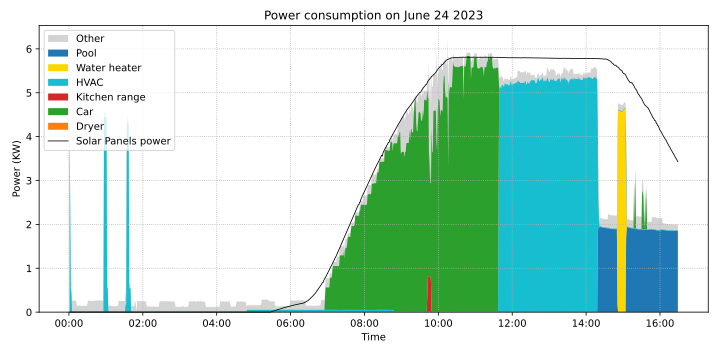
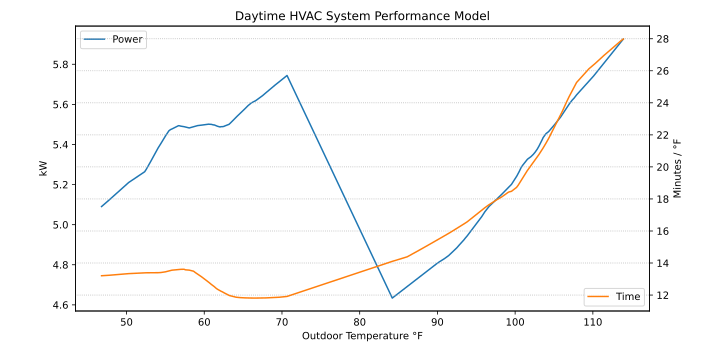

# Introduction

This project is a **Solar power usage optimization system for residential home**. It is a set of software components and services scheduling and optimizing devices of a residential home to optimally use solar generated power.

Back in May 2021, I installed solar panels on my roof. As a software engineer concerned by the global warming I decided to develop an optimization system to reduce my carbon footprint. As I would like this project to benefit other and to keep it growing I decided to share it publicly.

Optimizing requires having good understanding of what to optimize. In this particular case, it means which devices or appliances. I started collecting data from my electrical panel by installing sensors and within a few weeks I was able to identify the most energy-intensive devices.

I decided to focus on the following four devices (in order of priority):

1.  The electric car charger
2.  The HVAC (Heating, Ventilation, and Air Conditioning)
3.  The water heater
4.  The pool pump

An optimization system also requires metrics.  My motivation being environmental and knowing that the utility companies of my city are mostly producing electricity out of fossil energies, I decided to measure the performance of the system as the ratio of energy used from the solar panel over the total energy used. It means that the objective of the system is to fit as much as possible the home electricity needs in the time frame the solar panels are producing.

I have defined two measurable goals:

1.  The electric car should be charged at 100% with solar produced energy
2.  The home energy consumption (including the car charger) must be covered at more than two third by the solar energy

As of today, between `June 2021` and `March 2022`, the entire home energy consumption has been covered by solar energy at `66%`.

The following diagram represents the distribution of the energy consumption of my home per month since I started this project. It also includes the per-month ratio of energy used which originated from the solar panels (in light blue).

# Implementation

The system is split into various python modules running on a Raspberry Pi4. They provide services such as weather forecast, instant power consumption records, solar power prediction, home thermal model, HVAC performance model, appliances controls and a scheduler. In a modest way, this is also learning system. Indeed, it collects data and uses this data to generate models which influence the system decisions.

This project also includes some basic Home Assistant integration to ease the monitoring and control of the system as seen in the following screen capture.

Each module runs in a dedicated process and implements specified interfaces such as [Sensor](doc/sensor.md#sensor-objects) or [Task](doc/scheduler.md#task-objects). Alternatively or in addition, a module can expose its own original Service interface. The inter-processes communication relies on the [pyro5](https://pypi.org/project/Pyro5/) remote objects communication library. Each service, sensor or task is registered to the pyro5 nameserver under the `home-manager` namespace.  The services are under the `home-manager.service` sub-namespace, the sensors under the `home-manager.sensor` sub-namespace and the tasks are under the `home-manager.task` sub-namespace. For instance, the task responsible of the HVAC system is implemented by the [hvac](./src/hvac.py) module and registered as `home-manager.task.hvac` to the nameserver.

## Sensors

[Sensor](doc/sensor.md#sensor-objects) modules represent the sensor information of a device such the temperature and the humidity for a regular weather station.

### Car sensor

The [car\_sensor](./doc/car_sensor.md) (`home_manager.sensor.car`) module provides electric car information such as the current state of charge and mileage.

### Power sensor

The [power\_sensor](./doc/power_sensor.md) (`home_manager.sensor.power`) module provides instantaneous power consumption and power production readings. It also provides power reading over a certain period of time such as one minute, one hour or one day. This sensor is used by the [scheduler](./doc/scheduler.md) to build power consumption statistics leading to task scheduling decisions. Some tasks such as the [car\_charger](./doc/car_charger.md) also uses this sensor.

### Power simulator sensor

The [power\_simulator](./doc/power_simulator.md) (`home_manager.{sensor,service}.power_simulator`) module represents the solar panels configuration I have on my roof. Using the [pvlib](https://pvlib-python.readthedocs.io/en/stable/) library it is able to predict power production.

Similarly to [power\_sensor](./doc/power_sensor.md) the sensor part of this module provides instantaneous power consumption and production readings except that the production reading are based on a solar panel model and the consumption reading are based on current the tasks status.  [power\_simulator](./doc/power_simulator.md) also acts as fail-safe power sensor if [power\_sensor](./doc/power_sensor.md) is failing.
The service part of this module provides properties and functions such as:

-   The [max\_available\_power](./doc/power_simulator.md#max_available_power) property is the maximum instantaneous power in kW the solar panels are expected to deliver from now to the end of daytime.
-   The [next\_power\_window(power)](./doc/power_simulator.md#next_power_window) function returns the next time frame when `power` kW would be available on a clear and sunny day. This information is beneficial to tasks needing to know until when they can expect to get enough power to run.

### Weather sensor

The [weather](./doc/weather.md) (`home_manager.{sensor,service}.weather`) module provides instantaneous weather information such as temperature or wind speed. It also provides weather forecast service with special methods to get data such as the foretasted temperature at the certain point in time. The forecast service is critical to several modules. Solar panels production performances depend on multiple factors and in particular the temperature, wind speed and wind orientation. Therefor, the [power\_simulator](./doc/power_simulator.md) uses the weather forecast service to compute an accurate PV panels productions estimation.

## Scheduler

The central piece of the system is the [scheduler](./doc/scheduler.md). The [scheduler](./doc/scheduler.md) is responsible of optimally schedule registered tasks depending on priority level, power needs, task specific running criteria and of course, power availability. The scheduler module evaluates the situation and makes new decision every minutes.

The module keeps track of the power consumption with a sliding window of power records. It uses this data to determine the ratio of the energy a particular device has used compared to what the photovoltaic system has been producing. This ratio represents how much of the energy used by a particular appliance has been covered by the photovoltaic production over the time of the sliding window. This information is supplied to tasks along with their current power consumption when the scheduler is asking a task the current power conditions are acceptable to start the task or keep it running if it is already started.

The following power consumption diagram shows the scheduler starting and stopping task depending on the task specific parameters and the solar panels power production over an full day.

## Tasks and models

A [Task](./doc/scheduler.md#task-objects) is a module which registered itself to the scheduler to be run based on various parameters such as power ratio, priority &#x2026;etc Task are responsible of updating their priority level, implementing start and stop method, declaring if they can be run or stopped &#x2026;etc 

### Car charger task

The [car\_charger](./doc/car_charger.md) task (`home_manager.task.car_charger`) is responsible of charging the Electric Vehicle. It uses a simple strategy: the priority is set depending on the car battery current state of charge, the lower the state of charge the higher the priority. When this task is running, it automatically adjusts the charging rate to maximize the use of the solar panels production without exceeding it.

### Water heater task

The [water\_heater](./doc/water_heater.md) task (`home_manager.task.water_heater`) is responsible of heating the water tank. In opposition to the car which has a large enough capacity to be able to skip a couple of days of charge the water heater has to run every single day regardless of the photovoltaic production. Therefor the strategy is a little bit more complex: the task priority is set based on the water tank level and temperature but also on how close to the target time we are.

The target time is defined as the last point in time of the day when the photovoltaic system theoretically produces enough power to cover 100% of the water heater needs. In addition to that, if the priority is the highest possible and we are close to the target time, the water heater reports that it meets its running criteria regardless of the current consumption/production ratio. That way the [water\_heater](./doc/water_heater.md) task is guaranteed to be scheduled and meet its daily goal even under poor weather condition.

The water heater sensors are not very accurate especially the temperature sensor. As a result, the [water\_heater](./doc/water_heater.md) strategy is to wait for the water heater to not use any power to decide that it is full and at desired temperature.

### HVAC task

The [hvac](./doc/hvac.md) task (`home_manager.task.hvac`)  is responsible of heating and cooling the home during daylight. At night, the regular thermostat schedule resumes.

In my home the HVAC system clearly is the appliance consuming the most energy and this is why the HVAC optimization is critical.

Similarly to the [water\_heater](./doc/water_heater.md) task the target time is determined to automatically increase the priority as we gets closer to the last point in time the solar panels produce enough power to the HVAC needs. However, the algorithm determining the target time is slightly more complex because the HVAC system power consumption can significantly varies with the outdoor temperature (by &asymp; 20%). In addition, under high temperature or low temperature, the HVAC system needs more power than what the photovoltaic system can produce. In order to calculate the target time, the hvac task uses a performance model of the HVAC system which is automatically created by processing the database (see [models](./doc/models.md)). The following diagram is a representation of the HVAC performance model. For a certain range of outdoor temperatures, the blue line represents the power used by the HVAC system and the orange line the number of minutes needed to change the temperature by one degree Fahrenheit.

Once the hvac module has determined a target time, it automatically computes the passive thermal curve. The passive thermal curve is the temperature to be at each instant between now and goal time so that the temperature at goal time is goal temperature. For instance, in the following diagram, the goal time is 10:30pm and the goal temperature of  73°F. The passive thermal curve is the prediction represented in green. That day, the system ran the HVAC system three times (depending on priority and power availability) so that the indoor temperature crossed the passive curve at 2:36pm. At this point,  and taking into account the home thermal loss, at 10:30pm the home temperature was 73° as expected. In my area and for most of winter, it means that I do not need to run the HVAC at night while enjoying a comfortable temperature most of the time.

The algorithm which compute the passive curve uses a three dimensional home thermal model which is computed by processing recorded data (see [models](./doc/models.md)). For a given indoor and outdoor temperature, a thermal loss value is associated. The thermal loss unit in this model is degree Fahrenheit per minute. The following figure is a representation of this model.

### Pool Pump task

The [pool\_pump](./doc/pool_pump.md) task (`home_manager.task.pool_pump`)  is responsible of running the pool pump.

In term of pool filtering, keeping the pool water clean and clear of bacteria depends on the water/outdoor temperature and filtering time.  The [pool\_pump](./doc/pool_pump.md) uses the pool temperature or the minimal temperature within the next twenty four hours to decide how long the pool pump should be run for the day. The priority is adjusted as we get closer to the target time.

